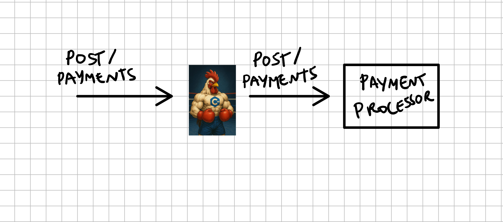

## Garnize on Juice

Projeto desenvolvido em C++ para o desafio [Rinha de Backend - 2025](https://github.com/zanfranceschi/rinha-de-backend-2025).


### O que é a Rinha do Backend

De acordo com o repositório oficial [zanfranceschi/rinha-de-backend-2025](https://github.com/zanfranceschi/rinha-de-backend-2025):

```
A Rinha de Backend é um desafio em que é necessário desenvolver uma solução backend em 
qualquer tecnologia e tem como principal objetivo o aprendizado e compartilhamento de 
conhecimento! Esta é a terceira edição do desafio.

```

### Objetivo

Desenvolver uma API que intermedia pagamentos para dois serviços de processamento de pagamentos com a menor taxa, lidando com instabilidades nos serviços. 

O objetivo é processar o máximo de pagamentos possível.

### Diagramas



@TODO

### Estrutura do Projeto

@TODO

## Referências

[Rinha de Backend 2025](https://github.com/zanfranceschi/rinha-de-backend-2025)

[RESTinio](https://stiffstream.com/en/products/restinio.html)

[Cpp Reference](https://cppreference.com/)

[ISO Cpp](https://isocpp.org/)

[Docker](https://docs.docker.com/)

[CLion](https://www.jetbrains.com/pt-br/clion/)

@TODO

# License

Please see the [license agreement](https://github.com/julianomacielferreira/garnize-on-juice/blob/main/LICENSE).