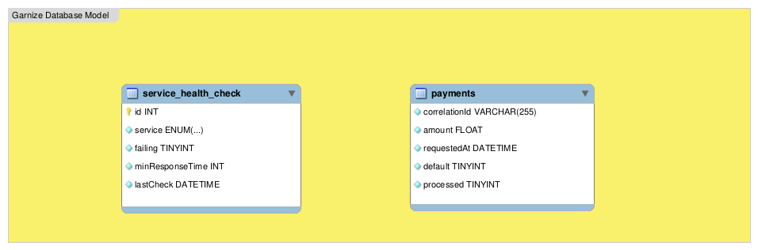

## Garnize on Juice $${\color{red}[in \space progress]}$$

Garnizé com suco foi um projeto desenvolvido em **C++** para o desafio [Rinha de Backend - 2025](https://github.com/zanfranceschi/rinha-de-backend-2025) atuando como uma API que intermedia pagamentos para dois serviços de processamento de pagamentos com a menor taxa, lidando com instabilidades nos serviços.

O <u>meu objetivo</u> foi utilizar o conhecimendo do livro [Princípios e Práticas de Programação com C++](https://www.amazon.com.br/Princ%C3%ADpios-Pr%C3%A1ticas-Programa%C3%A7%C3%A3o-com-C/dp/8577809587) que comprei há alguns anos e testar minhas habilidades em **C++**. 

Criei uma solução com o <u>**mínimo de dependências**</u> para processar o máximo de pagamentos possível (veja as regras no repositório da rinha [https://github.com/zanfranceschi/rinha-de-backend-2025/blob/main/INSTRUCOES.md]()).

Para entender melhor a solução, decisões técnicas adotadas, _insights_ sobre os obstáculos enfrentados, consulte a seção **`Detalhes Técnicos e Possíveis Melhorias`**.

**Nota:** O código deste projeto depende dos serviços de processamento de pagamento que estão em [https://github.com/zanfranceschi/rinha-de-backend-2025/tree/main/payment-processor]()


### O que é a Rinha do Backend

De acordo com o repositório oficial [zanfranceschi/rinha-de-backend-2025](https://github.com/zanfranceschi/rinha-de-backend-2025):

```
A Rinha de Backend é um desafio em que é necessário desenvolver uma solução backend em
qualquer tecnologia e tem como principal objetivo o aprendizado e compartilhamento de
conhecimento! Esta é a terceira edição do desafio.

```

### Estrutura do Projeto

```
.
├── compile.sh
├── DATABASE_MODEL.mwb
├── docker-compose.yml
├── Dockerfile
├── LICENSE
├── README.md
├── src
│   └── main.cpp
├── static
│   ├── DATABASE_MODEL.png
│   ├── garnize-on-juice.png
│   └── mesa-digitalizadora-wacom.jpg
├── test-purge-databse.sh
└── test-requests.sh

```

### Como compilar e depurar (com gdb)

Certifique-se de que você tenha a biblioteca SQLite, cURL e libuuid instaladas no seu sistema. Se você estiver usando um sistema baseado em Debian, pode instalar as bibliotecas com o seguinte comando:

```bash
$ sudo apt-get install libsqlite3-dev libcurl4-openssl-dev uuid-dev
```

Existe um script bash chamado `compile.sh` bastando torná-lo executável com a instrução `chmod +x compile.sh`.

Para usar o script, basta executá-lo com ou sem a flag `--debug`:

```bash
./compile.sh # Compila com flag de otimização
./compile.sh --debug # Compila para depuração
```

Para depurar o código, é necessário ter o `GDB (GNU Debugger)` instalado em sua máquina e usar a extensão `"C/C++"` do VSCode, que inclui suporte ao GDB.

Por exemplo, no Ubuntu, você pode usar o seguinte comando para instalar o `GDB (GNU Debugger)`:

```bash
sudo apt-get install gdb
```

É possível instalar a extensão `"C/C++"` diretamente no VSCode ou baixá-la do marketplace:

- [C/C++ for Visual Studio Code](https://marketplace.visualstudio.com/items?itemName=ms-vscode.cpptools)
- [C/C++ Extension Pack](https://marketplace.visualstudio.com/items?itemName=ms-vscode.cpptools-extension-pack)

O arquivo `launch.json` no diretório `.vscode` do projeto já configura a depuração no VSCode.

**Não é necessário nenhuma build tool (make, cmake, etc.).**

<sub>As instruções acima foram testadas somente em ambiente Linux.</sub>

### Como rodar com Docker

Pré-requisitos

- Docker e Docker Compose instalados na máquina
- Serviços de pagamento do Francisco Zanfranceschi [https://github.com/zanfranceschi/rinha-de-backend-2025/tree/main/payment-processor](https://github.com/zanfranceschi/rinha-de-backend-2025/tree/main/payment-processor)

Passo a Passo

1. Abra o terminal: Abra o terminal e navegue até a raiz do projeto.
2. Verifique se o Docker está funcionando: Execute o comando `docker --version` para verificar se o Docker está instalado e funcionando corretamente.

```bash
$ docker --version
```

```bash
Docker version 28.1.1, build 4eba377
```

3. Verifique se o Docker Compose está funcionando: Execute o comando `docker-compose --version` para verificar se o Docker Compose está instalado e funcionando corretamente.

```bash
$ docker-compose --version
```

```bash
docker-compose version 1.29.2, build 5becea4c
```

4. Construa as imagens: Execute o comando `docker-compose build` para construir as imagens Docker definidas no arquivo `docker-compose.yml`.

```bash
$ docker-compose build
```

```bash
WARNING: Some networks were defined but are not used by any service: payment-processor
Building garnize-on-juice
[+] Building (11/11) FINISHED
docker:default
 => [internal] load build definition from Dockerfile
 => => transferring dockerfile: 855B
 => [internal] load metadata for docker.io/library/alpine:latest
 => [auth] library/alpine:pull token for registry-1.docker.io
 => [internal] load .dockerignore
 => => transferring context: 140B
 => [1/5] FROM docker.io/library/alpine:latest@sha256:4bcff63911fcb4448bd4fdacec207030997caf25e9bea4045fa6c8c44de311d1
 => [internal] load build context
 => => transferring context: 2.11MB
 => CACHED [2/5] RUN apk update && apk add --no-cache alpine-sdk g++ && rm -rf /var/lib/apt/lists/*
 => CACHED [3/5] WORKDIR /app
 => [4/5] COPY . /app
 => [5/5] RUN g++ -std=c++17 -Wall -Wextra -O2 -o garnize_on_juice src/main.cpp
 => exporting to image
 => => exporting layers
 => => writing image sha256:041acf28099a9346a651030e225b73242712924e2bdc1bbeda30319567757a53
 => => naming to docker.io/library/garnize-on-juice_garnize-on-juice

```

5. Inicie os contêineres: Execute o comando `docker-compose up` para iniciar os contêineres Docker definidos no arquivo `docker-compose.yml`.

```bash
$ docker-compose up
```

```bash
WARNING: Some networks were defined but are not used by any service: payment-processor
Creating network "garnize-on-juice_default" with the default driver
Creating garnize-on-juice_garnize-on-juice_1 ... done
Attaching to garnize-on-juice_garnize-on-juice_1
garnize-on-juice_1  | Info: Garnize on Juice iniciado na porta 9999, escutando somente requests POST e GET
```

Observações

- Se você quiser rodar os contêineres em segundo plano, pode usar o comando `docker-compose up -d`.
- Se você quiser parar os contêineres, pode usar o comando `docker-compose stop`.
- Se você quiser remover os contêineres, pode usar o comando `docker-compose down`.

### Endpoints

- **`POST` /payments** (Intermedia a requisição para o processamento de um pagamento.)

```bash
$ curl --location --request POST 'http://localhost:9999/payments' \
--header 'Content-Type: application/json' \
--data '{
        "correlationId": "4a7901b8-7d26-4d9d-aa19-4dc1c7cf60b3",
        "amount": 19.90
    }'
```

<details>
<summary><b>Response</b></summary>

```json
{
  "message": "payment processed successfully"
}
```

</details>

---

- **`GET` /payments-summary?from={{ISO em UTC}}&to={{ISO em UTC}}** (Exibe detalhes das requisições de processamento de pagamentos.)

```bash
$ curl --location --request GET 'http://localhost:9999/payments-summary?from=2025-08-09T00%3A15%3A08.174Z&to=2025-08-09T00%3A15%3A08.174Z'
```

<details>
<summary><b>Response</b></summary>

```json
{
  "default": {
    "totalRequests": 43236,
    "totalAmount": 415542345.98
  },
  "fallback": {
    "totalRequests": 423545,
    "totalAmount": 329347.34
  }
}
```

</details>

---

- **`POST` /purge-payments** (Endpoint para limpar o banco SQLite.)

```bash
$ curl --location --request POST 'http://localhost:9999/purge-payments' \
--header 'Content-Type: application/json'
```

<details>
<summary><b>Response</b></summary>

```json
{
    "message": "Todas as tabelas do banco foram limpas! Eu espero que você saiba o que acabou de fazer.",
    "success": true
}
```

</details>

### Detalhes Técnicos e Possíveis Melhorias

Obviamente, a primeira melhoria seria aderir ao "estilo de programação C++". Tanto em relação a separação dos arquivos, paradigmas de programação, quanto com relação a arquitetura da solução.

Muitas partes da solução eu implementei "na mão", porém, não implementei tratativas para os diferentes erros que podem acontecer em outros cenários.

- Lógica de requests / responses de um servidor utilizando sockets (tive que ler o livro [Build Your Own Redis with C/C++](https://build-your-own.org/redis)) para entender como são as chamadas de sistema (system calls), como tratar requisições simultâneas, quais as abordagens possíveis, etc.
- Parsear o JSON sem usar nenhuma biblioteca (Ex.: `nlohmann/json`).
- Chegar na expressão regular correta que limpava o JSON vindo da request body antes de tentar fazer o parsing.

#### Modelo do Banco de Dados



#### SQL em um arquivo externo

O SQL para criar as tabelas está chumbado no código:

```sql
 CREATE TABLE IF NOT EXISTS service_health_check (
                service TEXT CHECK(service IN ('default', 'fallback')) NOT NULL,
                failing INTEGER NOT NULL,
                minResponseTime INTEGER NOT NULL,
                lastCheck DATETIME NOT NULL
            );

INSERT INTO `service_health_check` (`service`, `failing`, `minResponseTime`, `lastCheck`) SELECT 'default', 0, 100, DATETIME('now') WHERE NOT EXISTS (SELECT 1 FROM service_health_check WHERE service = 'default');

INSERT INTO `service_health_check` (`service`, `failing`, `minResponseTime`, `lastCheck`) SELECT 'fallback', 0, 100, DATETIME('now') WHERE NOT EXISTS (SELECT 1 FROM service_health_check WHERE service = 'fallback');

CREATE TABLE IF NOT EXISTS payments (
                correlationId TEXT NOT NULL,
                amount REAL NOT NULL,
                requestedAt DATETIME NOT NULL,
                defaultService TINYINT NOT NULL,
                processed TINYINT NOT NULL
            );
-- Pode ser criado, se houver necessidade de realizar buscas pela coluna
CREATE INDEX IF NOT EXISTS idx_correlationId ON payments (correlationId);
```

#### A coluna ``correlationId`` deveria ser BLOB e não TEXT

Salvar UUIDs como campos ``TEXT`` no SQLite pode ter perda de desempenho em comparação com salvar como campos ``BLOB``.

Algumas razões pelas quais isso pode ocorrer:

1. Tamanho do campo: Os UUIDs como strings ``TEXT`` ocupam mais espaço do que os UUIDs como ``BLOB``, pois as strings precisam de caracteres adicionais para representar os traços e outros caracteres. Isso pode aumentar o tamanho da tabela e afetar o desempenho de consultas.
2. Indexação: A indexação de campos ``TEXT`` pode ser mais lenta do que a indexação de campos ``BLOB``, pois as strings precisam ser comparadas caractere por caractere.
3. Conversão: Ao salvar UUIDs como ``TEXT``, o SQLite precisa converter o ``UUID`` para uma string, o que pode ser um processo lento.

#### Estrutura de classes criada

Todas as classes e estruturas estão no arquivo `main.cpp` ao 'melhor' estilo `javascript`. A principal melhoria seria criar os respectivos arquivos
de cabeçalhos (headers .h) e separá-las do arquivo principal.

@TODO

#### Buffer de tamanho fixo para ler dados da conexão

O tamanho de 1024 é comum em muitas aplicações de rede porque é uma potência de 2 (2<sup>10</sup>) e é grande o suficiente para armazenar uma quantidade razoável de dados, mas não tão grande que cause problemas de desempenho ou uso excessivo de memória.

No entanto, é importante notar que o uso de um buffer de tamanho fixo pode ter algumas limitações:

- Se a requisição HTTP for maior que 1024 bytes, ela será truncada e pode causar problemas.
- Se a requisição HTTP for muito pequena, o buffer pode ter espaço não utilizado.

Uma abordagem mais robusta seria usar um buffer dinâmico que possa crescer ou diminuir de acordo com as necessidades da aplicação.

Além disso, a função `read` não garante que todos os 1024 bytes sejam lidos de uma vez. É possível que a função retorne um valor menor que 1024, indicando que apenas uma parte dos dados foi lida. Nesse caso, é necessário chamar a função `read` novamente para ler o restante dos dados.

#### Vantagens na abordagem de usar threads ou async I/O

1. Threads: Com threads, você pode criar uma thread para cada requisição que chega ao servidor. Cada thread pode fazer a requisição ao microserviço e esperar pela resposta sem bloquear as outras threads. Isso permite que o servidor processe múltiplas requisições simultaneamente e não bloqueie enquanto espera pela resposta do microserviço.
2. Async I/O: Com async I/O, você pode fazer requisições ao microserviço de forma assíncrona, o que significa que o servidor não bloqueia enquanto espera pela resposta. Em vez disso, o servidor pode continuar processando outras requisições e receber notificações quando a resposta do microserviço estiver disponível.

Ambas as abordagens permitem que o servidor processe múltiplas requisições simultaneamente e não bloqueie enquanto espera pela resposta do microserviço. No entanto, a escolha entre threads e async I/O depende do design do seu servidor e das suas necessidades específicas.

Desvantagens de threads:

- Pode ser mais difícil de gerenciar e sincronizar as threads.
- Pode haver problemas de concorrência e deadlock se não forem implementados corretamente.

Desvantagens de async I/O:

- Pode ser mais difícil de implementar, especialmente se você não estiver familiarizado com programação assíncrona.
- Pode ser mais difícil de depurar e testar.

#### Explicação sobre a expressão regular utilizada para remover espaços em brancos desnecessários em um string JSON:

```c++
   static string removeUnnecessarySpaces(const string &jsonString)
   {
       return regex_replace(jsonString, regex("\\s+(?=(?:[^\"']*[\"'][^\"']*[\"'])*[^\"']*$)"), "");
   }
```

- `\\s+`: Essa parte da expressão regular busca por um ou mais espaços em branco (`\s` é o caractere especial para espaços em branco, e o `+` significa "um ou mais"). O `\\` é usado para escapar o caractere `\` porque em C++ o `\` é um caractere especial.
- `(?=...)`: Essa é uma "asserção de lookahead" positiva. Ela verifica se a expressão regular dentro dos parênteses é verdadeira, mas não consome os caracteres. Em outras palavras, ela verifica se a condição é satisfeita sem incluir os caracteres na correspondência.
- `([^\"']*[\"'][^\"']*[\"'])*`: Essa parte da expressão regular verifica se o espaço em branco está dentro ou fora de uma string delimitada por aspas. Ela funciona da seguinte forma:
- `[^\"']*`: Busca por zero ou mais caracteres que não são aspas (`[^\"']` é uma classe de caracteres negada que inclui todos os caracteres exceto aspas).
- `[\"']`: Busca por uma aspa (`[\"']` é uma classe de caracteres que inclui aspas duplas e simples).
- `[^\"']*`: Busca por zero ou mais caracteres que não são aspas novamente.
- `[\"']`: Busca por outra aspa.
- `*`: O asterisco significa "zero ou mais" da expressão anterior. Isso permite que a expressão regular verifique se há um número par de aspas (ou seja, se as aspas estão balanceadas).
- `[^\"']*$`: Essa parte da expressão regular verifica se a string restante não contém aspas. O `*` significa "zero ou mais" caracteres que não são aspas, e o `$` significa "fim da string".

#### O método `parseJson()` da classe `JsonParser` não trata todos possíveis casos que podem ocorrer em um JSON.

Abaixo, estão listados casos que devem ser tratados em um cenário mais real.

**1. Estrutura de objetos:**

- Objetos vazios (`{}`)
- Objetos com uma ou mais chaves-valor (`{"chave": "valor"}`)
- Objetos aninhados (`{"chave": {"outraChave": "valor"}}`)

**2. Tipos de valores:**

- Números (`123`, `3.14`)
- Booleanos (`true`, `false`)
- Null (`null`)
- Arrays (`[1, 2, 3]`)

**3. Chaves:**

- Chaves com strings complexas (`"chave com espaços" ou "chave com caracteres especiais: !@#$%^&*()"`)

**4. Valores:**

- Valores com strings complexas (`"valor com espaços" ou "valor com caracteres especiais: !@#$%^&*()"`)

**5. Arrays:**

- Arrays vazios (`[]`)
- Arrays com um ou mais elementos (`[1, 2, 3]`)
- Arrays aninhados (`[1, [2, 3], 4]`)

**6. Erros de sintaxe:**

- Chaves ou valores não fechados (`{"chave": "valor"`)
- Vírgulas ou dois-pontos faltando (`{"chave" "valor"}`)
- Caracteres inválidos

**7. Espaçamento:**

- Espaçamento dentro de strings (`"valor com espaços"`)

#### Por que inicializar váriáveis estáticas declaradas dentro de uma classe, fora dela ?

Isso é necessário devido à forma como as variáveis estáticas são tratadas em C++.

Quando você declara uma variável estática dentro de uma classe, você está apenas declarando que a variável existe e tem um determinado tipo. No entanto, a variável em si não é criada até que seja definida fora da classe.

A declaração da variável estática dentro da classe é como uma promessa ao compilador de que a variável será definida em algum lugar. A definição da variável fora da classe é onde a variável é realmente criada e alocada memória.

Se você não definir a variável estática fora da classe, o compilador saberá que a variável existe, mas o linker não encontrará a definição da variável e irá gerar um erro de "undefined reference".

Isso é uma regra do padrão C++ para evitar problemas de múltiplas definições de variáveis estáticas em diferentes unidades de compilação.


### Livro Princípios e Práticas de Programação com C++


### Ferramentas

Utilizei também minha mesa digitalizadora wacom com o software Xournal++ para rascunhar e elaborar melhor as soluções.


## Referências

[Rinha de Backend 2025](https://github.com/zanfranceschi/rinha-de-backend-2025)

[Debug C++ in Visual Studio Code](https://code.visualstudio.com/docs/cpp/cpp-debug)

[Cpp Reference](https://cppreference.com/)

[ISO Cpp](https://isocpp.org/)

[The Shell Scripting Tutorial](https://www.shellscript.sh/)

[Docker](https://docs.docker.com/)

[Docker Compose](https://docs.docker.com/compose/)

[Build Your Own Redis with C/C++](https://build-your-own.org/redis/)

[The Linux Programming Interface by Michael Kerrisk.](https://man7.org/tlpi/)

[Algoritmo Mersenne Twister](https://en.wikipedia.org/wiki/Mersenne_Twister)

[Xournal++](https://xournalpp.github.io/)

[Mesa Digitalizadora One By Wacom CTL472, Pequena, Cor Preto e Vermelho](https://www.mercadolivre.com.br/mesa-digitalizadora-one-by-wacom-ctl472-pequena-cor-preto-e-vermelho)

# License

Please see the [license agreement](https://github.com/julianomacielferreira/garnize-on-juice/blob/main/LICENSE).
