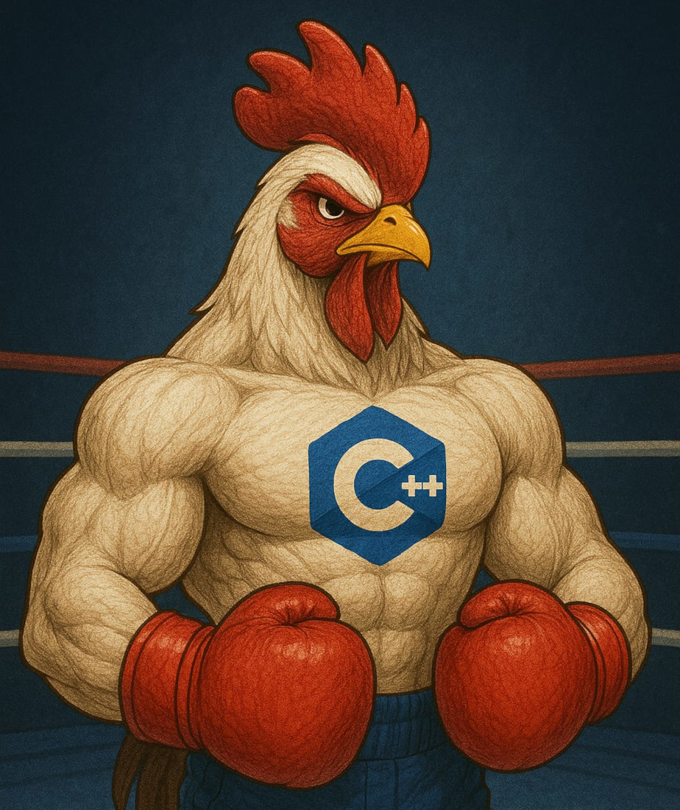

## Garnize on Juice $${\color{red}[in \space progress]}$$

Projeto desenvolvido em C++ para o desafio [Rinha de Backend - 2025](https://github.com/zanfranceschi/rinha-de-backend-2025).



### O que é a Rinha do Backend

De acordo com o repositório oficial [zanfranceschi/rinha-de-backend-2025](https://github.com/zanfranceschi/rinha-de-backend-2025):

```
A Rinha de Backend é um desafio em que é necessário desenvolver uma solução backend em 
qualquer tecnologia e tem como principal objetivo o aprendizado e compartilhamento de 
conhecimento! Esta é a terceira edição do desafio.

```

### Como compilar e rodar o Projeto

@TODO

### Objetivo

Desenvolver uma API que intermedia pagamentos para dois serviços de processamento de pagamentos com a menor taxa, lidando com instabilidades nos serviços. 

O objetivo é processar o máximo de pagamentos possível.

### Diagramas

Para criá-los utilizei uma mesa digitalizadora wacom.


Primeiro cenário desenvolvido:

- Requests para o processador de pagamentos padrão.


@TODO

### Estrutura do Projeto

@TODO

### Detalhes Técnicos

Explicação sobre a expressão regular utilizada para remover espaços em brancos desnecessários em um string JSON:

 ```c++
    /**
     * @brief Remove os espaços em branco desnecessários de uma string JSON.
     *
     * Esse método utiliza uma expressão regular para remover os espaços em branco que não estão dentro de strings delimitadas por aspas.
     *
     * @param jsonString A string JSON a ser processada.
     * @return A string JSON com os espaços em branco desnecessários removidos.
     */
    static string removeUnnecessarySpaces(const string &jsonString)
    {
        return regex_replace(jsonString, regex("\\s+(?=([^\"']*[\"'][^\"']*[\"'])*[^\"']*$"), "");
    }
 ```

- ``\\s+``: Essa parte da expressão regular busca por um ou mais espaços em branco (\s é o caractere especial para espaços em branco, e o + significa "um ou mais"). O ``\\`` é usado para escapar o caractere ``\`` porque em C++ o ``\`` é um caractere especial.
- ``(?=...)``: Essa é uma "asserção de lookahead" positiva. Ela verifica se a expressão regular dentro dos parênteses é verdadeira, mas não consome os caracteres. Em outras palavras, ela verifica se a condição é satisfeita sem incluir os caracteres na correspondência.
- ``([^\"']*[\"'][^\"']*[\"'])*``: Essa parte da expressão regular verifica se o espaço em branco está dentro ou fora de uma string delimitada por aspas. Ela funciona da seguinte forma:
- ``[^\"']*``: Busca por zero ou mais caracteres que não são aspas (``[^\"']`` é uma classe de caracteres negada que inclui todos os caracteres exceto aspas).
- ``[\"']``: Busca por uma aspa (``[\"']`` é uma classe de caracteres que inclui aspas duplas e simples).
- ``[^\"']*``: Busca por zero ou mais caracteres que não são aspas novamente.
- ``[\"']``: Busca por outra aspa.
- ``*``: O asterisco significa "zero ou mais" da expressão anterior. Isso permite que a expressão regular verifique se há um número par de aspas (ou seja, se as aspas estão balanceadas).
- ``[^\"']*$``: Essa parte da expressão regular verifica se a string restante não contém aspas. O ``*`` significa "zero ou mais" caracteres que não são aspas, e o ``$`` significa "fim da string".


## Referências

[Rinha de Backend 2025](https://github.com/zanfranceschi/rinha-de-backend-2025)

[Cpp Reference](https://cppreference.com/)

[ISO Cpp](https://isocpp.org/)

[Docker](https://docs.docker.com/)

[Build Your Own Redis with C/C++](https://build-your-own.org/redis/)

[The Linux Programming Interface by Michael Kerrisk.](https://man7.org/tlpi/)

[Mesa Digitalizadora One By Wacom CTL472, Pequena, Cor Preto e Vermelho](https://www.mercadolivre.com.br/mesa-digitalizadora-one-by-wacom-ctl472-pequena-cor-preto-e-vermelho)

# License

Please see the [license agreement](https://github.com/julianomacielferreira/garnize-on-juice/blob/main/LICENSE).